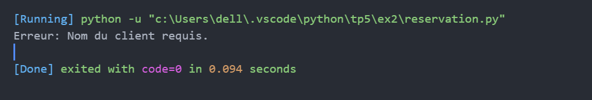
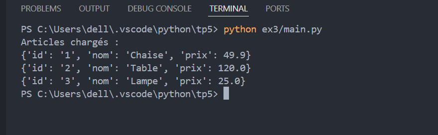

# 📘 TP5 : Exceptions en Python

## Nom du TP : Gestion des exceptions personnalisées en Python

---

## EXERCICE 1 :
### Titre : Gestion d’un compte bancaire
Description rapide :  
Implémentation des classes `CompteBancaire` et `SoldeInsuffisantException`.

---

## EXERCICE 2 :
### Titre : Système de réservation d’événement
Description rapide :  
Hiérarchie d’exceptions : `ReservationException`, `NomClientInvalideException`, etc.

---

## EXERCICE 3 :
### Titre : Import CSV sécurisé
Description rapide :  
Validation des fichiers CSV avec exceptions personnalisées.

---
